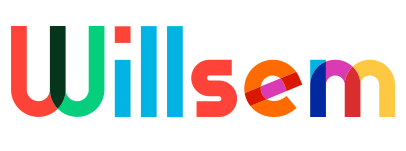

    

> [ <b valign="middle">BMSTU ICS7 LABORATORY WORKS</b>](https://github.com/bmstu-ics7)

<table>
    <tr>
        <td valign="top">
            
        </td>
        <td valign="top">
            
        </td>
    </tr>
</table>

    

### Languages

### Dev Ops

### Code editors

